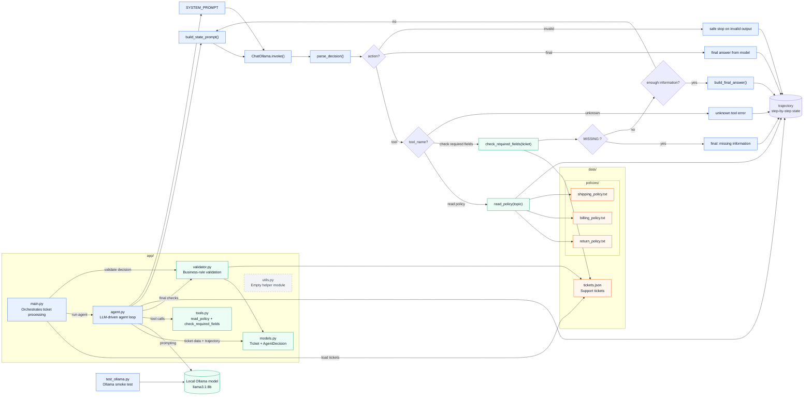

# Repo Flowchart

Nedan finns en översikt av det som faktiskt ingår i körflödet: `app/`, `data/` och den lokala Ollama-kontrollen.

## Kort läsning av flödet

1. `app/main.py` läser tickets från `data/tickets.json`.
2. Varje ticket skickas till `app/agent.py`, där modellen får välja mellan verktygsanrop eller ett slutligt svar.
3. Verktygen i `app/tools.py` läser lokala policyfiler eller kontrollerar obligatoriska fält.
4. Agenten bygger upp en `trajectory` för att undvika upprepningar och för att kunna avsluta säkert.
5. `app/validator.py` körs efteråt för att kontrollera affärsregler, särskilt för retur- och faktureringsärenden.
6. `test_ollama.py` är ett separat smoke test mot den lokala Ollama-modellen.
