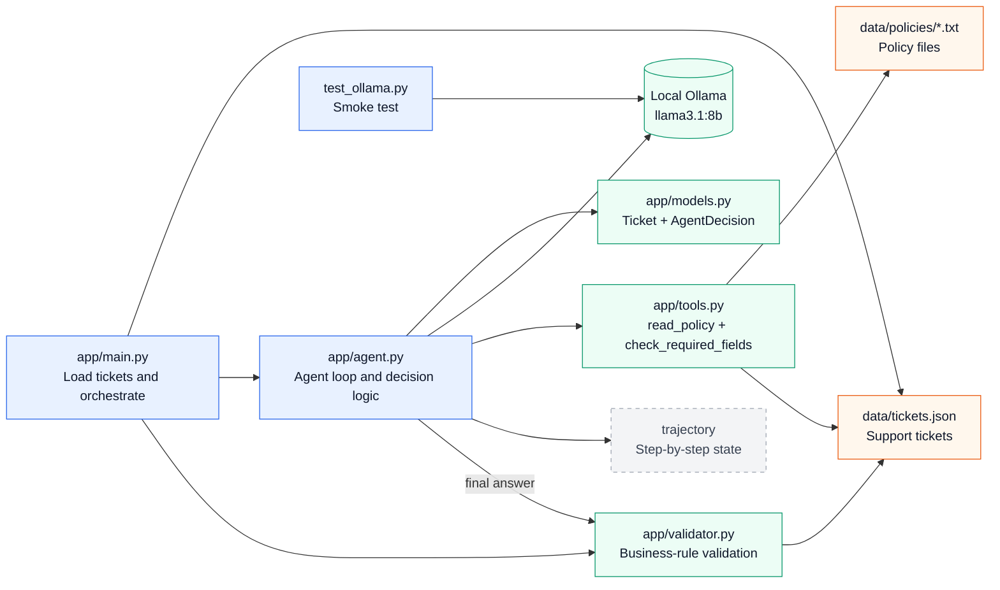

# Runtime Flowchart

## Kort läsning

1. `app/main.py` läser tickets och kör agenten för varje ärende.
2. `app/agent.py` frågar den lokala Ollama-modellen vad nästa steg ska vara.
3. Agenten kan läsa policyfiler eller kontrollera obligatoriska fält via `app/tools.py`.
4. Beslut och observationer sparas i en trajectory så att agenten inte upprepar sig.
5. `app/validator.py` gör en efterkontroll av slutbeslutet.
6. `test_ollama.py` är en separat kontroll mot samma lokala modell.